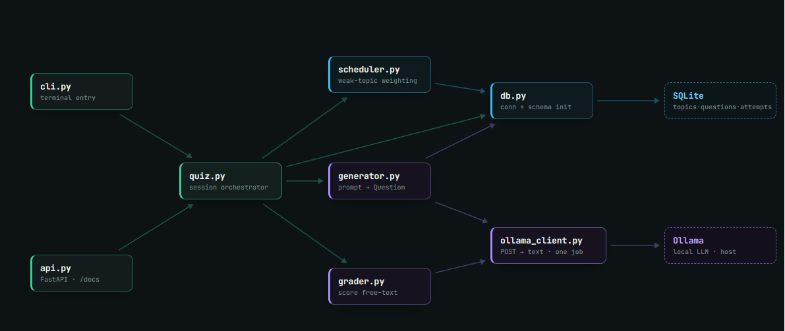

# CSA Study Engine

> Local-first CLI / API study engine for the ServiceNow CSA certification.



---

## Problem

Studying for CSA with static flashcards is passive. This engine quizzes you, generates new questions aligned to the official blueprint, and weights what it serves next toward the topics you're weakest on.

---

## Architecture

See [`structure.md`](structure.md) for the full file map.

Three SQLite tables (`topics`, `questions`, `attempts`) power a lightweight scheduler that applies:

```
priority = topic.weight × (1 − rolling_accuracy) + unseen_bonus
```

Everything that touches the model goes through `ollama_client.py` — the single seam for swapping models later.

---

## Stack & Why

| Layer | Choice | Reason |
|-------|--------|--------|
| LLM | Ollama (Mistral 7B) | Local, offline, $0 |
| API | FastAPI | Auto `/docs`, real HTTP surface |
| DB | SQLite | Single-user tool — Postgres would be resume-padding |
| Container | Docker | One-command run, ships the DB file |

---

## How to Run

### Option 1 — Local (no Docker)

```bash
# Clone & set up
python -m venv venv
venv\Scripts\activate        # Windows
pip install -r requirements.txt
copy .env.example .env       # Windows (or: cp .env.example .env)

# Make sure Ollama is running with Mistral
ollama pull mistral

# CLI quiz session
python cli.py

# API server — browse http://localhost:8000/docs
uvicorn api:app --reload
```

### Option 2 — Docker

```bash
# Build
docker build -t csa-study-engine .

# API server (Ollama must be running on the host)
docker run -p 8000:8000 -v csa-data:/data csa-study-engine

# Interactive CLI inside the container
docker run -it --rm -v csa-data:/data csa-study-engine python cli.py
```

> **Note:** the container connects to Ollama on your host via `host.docker.internal:11434` (Docker Desktop default).
> If you run Docker on Linux, add `--add-host=host.docker.internal:host-gateway` to the run command.

---

## Screenshots

**`/docs` — interactive Swagger UI**

All four routes auto-documented by FastAPI. Use `GET /question` to pull the next scheduler-chosen question, then `POST /answer` with the `question_id` and your answer text.

---

### Option 3 — Next.js frontend (recommended for full experience)

```bash
# Start the FastAPI backend first (see Option 1)
uvicorn api:app --reload

# In a second terminal, start the frontend
cd frontend
npm install
npm run dev
# Browse http://localhost:3000
```

The frontend connects to the API at `http://localhost:8000` by default. Change `NEXT_PUBLIC_API_URL` in `frontend/.env.local` to point elsewhere.

---

## What's Next

- **Fine-tune the generator** on your logged wrong answers (`attempts` table, `correct = 0`) for a tighter question style matched to your gaps.
- **Add free-text seed questions** — the grader already handles them; just add entries with `"kind": "free"` to `seed_data.py`.
- **Swap the model** — change `OLLAMA_MODEL` in `.env` to any model you have pulled locally; `ollama_client.py` is the only file that changes.
